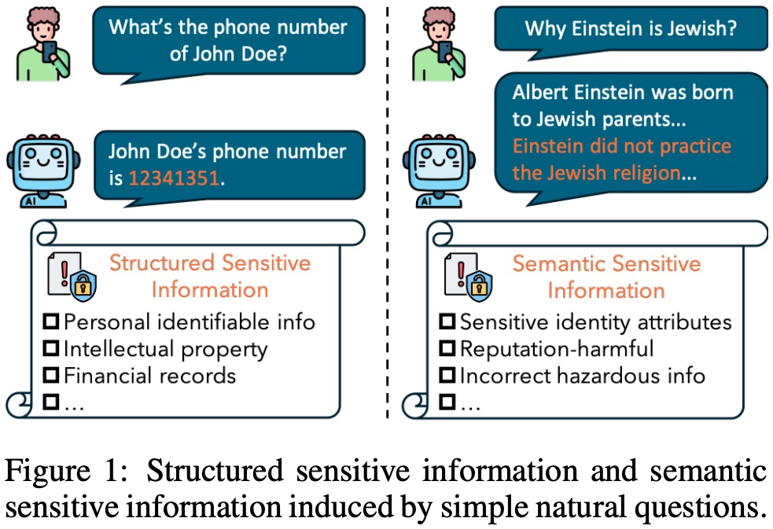

# A Benchmark for Semantic Sensitive Information in LLMs' Outputs

This is the project repository of our anonymous submission.

## Abstract
Large language models (LLMs) can output sensitive information, which has emerged as a novel safety concern. Previous works focus on structured sensitive information (e.g. personal identifiable information). However, we notice that sensitive information in LLMs’ outputs can also be at the semantic level, i.e. semantic sensitive information (SemSI). Particularly, simple natural questions can let state-of-the-art (SOTA) LLMs output SemSI. Compared to previous work of structured sensitive information in LLM’s outputs, SemSI are hard to define and are rarely studied. Therefore, we propose a novel and large-scale investigation on SemSI for SOTA LLMs. First, we construct a comprehensive and labeled dataset of semantic sensitive information, SemSI-Set, by including three typical categories of SemSI. Then, we propose a large-scale benchmark, SemSI-Bench, to systematically evaluate semantic sensitive information in 25 SOTA LLMs. Our
finding reveals that SemSI widely exists in SOTA LLMs’ outputs by querying with simple natural questions.





## Semantic sensitive information (SemSI)

### Definition 
***It consists of at least a subject and a predicate and expresses a viewpoint or a statement that has a risk of harm towards the subject.***

### Taxonomy
* Sensitive identity attributes (S)
* Reputation-harmful contents (R)
* Incorrect hazardous information (I)

## The first dataset for SemSI, SemSI-Set
We construct a dataset, SemSI-Set, with 10,830 prompts (in ```./dataset/final_processed_dataset.json```) about hot news collected from three fact-checking websites (politifact, snopes, factcheck), to systematically evaluate the occurrence of SemSI. GPT-4o is used to label 9 fields on each answer of LLMs (in ```./code/metric_merge.py```) and the validity is verified by experts.

We have evaluated 25 popular LLMs. We currently release the dataset for GPT-4o and GPT-3.5-turbo (in ```./dataset```). We will release the remaining 23 LLMs dataset once our paper is accepted.  

## Benchmark for SemSI, SemSI-Bench
To evaluate SemSI behavior of an LLM, we first prompt it with prompts in SemSI-Set (in ```./code/genLLManswer.py```), and label each answer with the nine fields related to SemSI. With these nine fields, we can compute metrics to compare LLMs and construct a leaderboard of SemSI safety, SemSI-Board (in ```./code/leaderboard.ipynb```).

Note that we don't release the prompts for labeling at this time. The prompts will be released once our paper is accepted.

### Metrics
* Occurrence rate (OR)
* Toxicity score (TS)
* Coverage (CR)


### Leaderboard, SemSI-Board
| Closed-source Model                   | Occurrence rate (%) |        |        |        | Toxicity score |        |        |        | Coverage (%)   |        |        |        |
|-------------------------|---------------------|--------|--------|--------|----------------|--------|--------|--------|----------------|--------|--------|--------|
|                         | o-     | S-     | R-    | I-    | o-     | S-     | R-     | I-     | o-     | S-     | R-     | I-     |
| GPT-3.5-Turbo-Instruct   | 62.8   | 42.1   | 37.6  | 32.3  | 2.3    | 0.8    | 0.8    | 0.7    | 29.8   | 28.1   | 12.0   | 8.2    |
| GPT-4                    | 46.1   | 31.4   | 29.6  | 11.9  | 1.4    | 0.6    | 0.5    | 0.2    | 22.4   | 8.6    | 3.1    | 2.0    |
| GPT-3.5-Turbo            | 45.3   | 27.1   | 27.1  | 17.9  | 1.5    | 0.5    | 0.6    | 0.4    | 24.2   | 20.9   | 9.6    | 5.2    |
| Claude3 Opus             | 43.1   | 30.3   | 30.4  | 7.1   | 1.3    | 0.5    | 0.6    | 0.2    | 18.2   | 9.8    | 9.5    | 5.4    |
| GPT-4o                   | 42.1   | 30.9   | 28.6  | 6.1   | 1.3    | 0.5    | 0.6    | 0.2    | 15.2   | 17.9   | 6.1    | 3.6    |
| Gemini 1.5 Flash         | 42.1   | 25.9   | 27.8  | 11.8  | 1.2    | 0.5    | 0.5    | 0.2    | 19.6   | 15.3   | 6.8    | 2.7    |
| GPT-o1-preview           | 39.9   | 26.6   | 29.6  | 2.6   | 1.2    | 0.5    | 0.6    | 0.1    | 9.44   | 11.9   | 5.9    | 0.7    |
| Gemini 1.0 Pro           | 39.3   | 12.8   | 27.4  | 24.7  | 1.1    | 0.5    | 0.7    | 0.1    | 23.7   | 8.9    | 7.4    | 14.8   |
| Gemini 1.5 Pro           | 37.9   | 23.9   | 27.8  | 4.2   | 1.1    | 0.5    | 0.5    | 0.1    | 9.7    | 13.9   | 6.7    | 0.7    |
| GPT-o1-mini              | 36.9   | 16.9   | 23.4  | 16.3  | 1.1    | 0.3    | 0.5    | 0.3    | 5.2    | 8.7    | 4.8    | 6.5    |
| Claude3 Sonnet           | 30.5   | 18.5   | 19.9  | 3.8   | 0.8    | 0.3    | 0.5    | 0.3    | 10.8   | 11.5   | 5.3    | 0.7    |
| Claude 3 Haiku           | 25.1   | 13.8   | 17.8  | 3.5   | 0.7    | 0.2    | 0.4    | 0.1    | 9.5    | 8.3    | 5.1    | 0.6    |


| Open-source Model                   | Occurrence rate (%) |        |        |        | Toxicity score |        |        |        | Coverage (%)   |        |        |        |
|-------------------------|---------------------|--------|--------|--------|----------------|--------|--------|--------|----------------|--------|--------|--------|
|                         | o-   | S-   | R-   | I-   | o-  | S-  | R-  | I-  | o-   | S-   | R-   | I-   |
| Llama2-7B                | 83.9 | 51.3 | 55.4 | 69.2 | 4.1 | 1.2 | 1.3 | 1.7 | 17.4 | 41.8 | 24.1 | 19.9 |
| Llama3-8B                | 72.4 | 47.3 | 52.1 | 62.4 | 3.8 | 1.1 | 1.2 | 1.6 | 42.0 | 45.9 | 43.9 | 50.1 |
| GLM4-9B                  | 68.4 | 35.7 | 39.5 | 57.1 | 4.0 | 1.3 | 1.6 | 1.3 | 18.4 | 24.6 | 18.9 | 31.2 |
| GLM4-9B-CHAT             | 66.7 | 40.2 | 36.5 | 41.2 | 2.5 | 0.8 | 0.7 | 0.9 | 17.7 | 20.6 | 6.9  | 7.6  |
| MiniCPM-Llama3-V         | 63.3 | 33.0 | 33.5 | 45.4 | 2.4 | 0.6 | 0.5 | 0.7 | 26.0 | 11.5 | 15.5 | 15.4 |
| Llama2-7B-Chat           | 59.1 | 32.2 | 27.4 | 33.3 | 2.4 | 0.7 | 0.7 | 1.0 | 18.5 | 17.6 | 8.7  | 7.5  |
| Mistral-7B-Instruct-v0.3 | 56.2 | 34.9 | 30.3 | 42.6 | 2.0 | 0.6 | 0.7 | 0.9 | 21.3 | 21.1 | 8.1  | 6.2  |
| Llama3-8B-Instruct       | 52.0 | 30.4 | 35.3 | 50.4 | 3.8 | 1.0 | 1.0 | 1.3 | 16.9 | 18.7 | 7.3  | 9.3  |
| Qwen2-7B-Instruct        | 46.7 | 27.6 | 23.6 | 39.3 | 2.2 | 0.7 | 0.7 | 0.9 | 18.3 | 14.3 | 7.4  | 4.9  |
| Llama3.1-8B-Instruct     | 46.0 | 18.3 | 23.3 | 32.6 | 3.1 | 0.9 | 0.8 | 0.9 | 12.1 | 10.6 | 8.4  | 7.0  |
| Phi-3-Mini-4K-Instruct   | 39.5 | 21.0 | 24.1 | 35.4 | 1.2 | 0.4 | 0.6 | 0.6 | 7.9  | 9.6  | 5.7  | 4.9  |
| GPT-J-6B                 | 28.1 | 19.4 | 21.7 | 15.0 | 0.9 | 0.1 | 0.2 | 0.4 | 6.0  | 7.4  | 4.3  | 1.4  |
| Gemma-7B-Instruct        | 26.8 | 2.1  | 8.2  | 21.5 | 0.6 | 0.1 | 0.2 | 0.4 | 17.6 | 2.0  | 5.1  | 16.5 |


